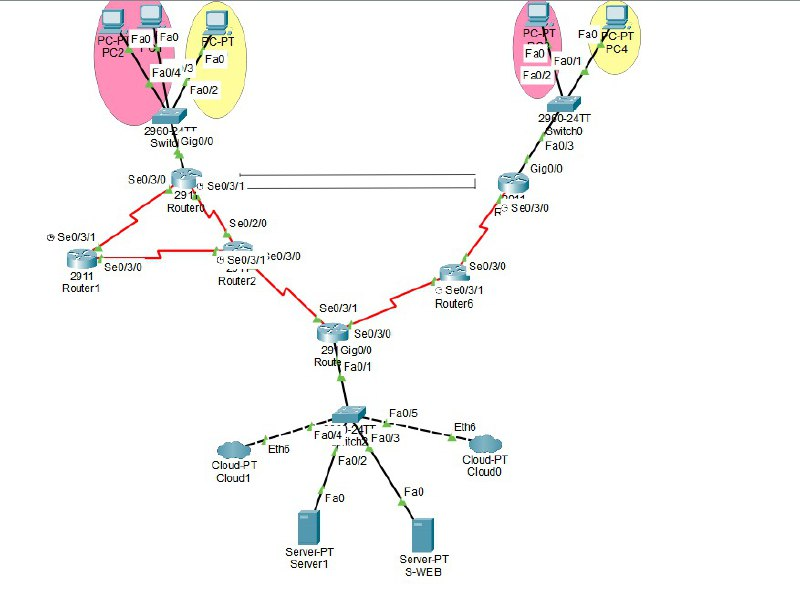

# Computer Networks Laboratory | ESI-SBA
Engineered and automated enterprise-grade network infrastructure with multi-protocol routing, advanced security, and real-time management systems.

## 🚀 Quick Navigation
- [Project Scope](#scope)
- [Protocol Architecture](#architecture)
- [Network Topology](#network-topology) 
- [Technical Stack](#tech-stack)
- [Implementation Highlights](#highlights)
- [Technical Competencies](#competencies)

## 🎯 Project Scope 
Designed and deployed a full-stack networking environment integrating dynamic routing, secure segmentation, and automated management systems for enterprise-level operations.

## 🏗️ Protocol Architecture 
### Dynamic Routing Suite

- OSPF multi-area deployments with route redistribution

- EIGRP advanced metric configurations

- RIP/RIPv2 legacy protocol integration

- Network Segmentation

- VLAN-based security zoning

- Inter-VLAN routing with ACL enforcement

- STP optimization for loop prevention

### Service Infrastructure

- DHCP scoping with reservation policies

- DNS hierarchical domain resolution

- NAT/PAT translation strategies

- SNMP v2/v3 monitoring implementations

### Security Framework

- Site-to-Site VPN with encryption protocols

- Access Control List rule optimization

- Secure socket programming implementations

## 🏗️ Network Topology 
Complete network infrastructure showing routing, switching, and service distribution

## ⚙️ Technical Stack 
### Simulation & Analysis

- Cisco Packet Tracer for topology validation

- GNS3 for real deployment

- Wireshark for deep packet inspection

### Protocol Implementation

- IGP/EGP routing protocol suites

- Layer 2/3 switching technologies

- Service protocol configurations

### Automation & Development

- Python socket programming for custom protocols

- RESTful API for network automation

## 💡 Implementation Highlights 
### Advanced Routing Deployment

- Configured OSPF multi-area networks with virtual links

- Implemented EIGRP unequal cost load balancing

- Established route redistribution between protocols

### Security-Centric Segmentation

- Deployed VLAN-based security zones with private VLANs

- Implemented port security and DHCP snooping

- Configured context-based access control

### Enterprise Service Integration

- Built hierarchical DNS with forward/reverse zones

- Implemented NAT overload with port address translation

- Deployed SNMP monitoring with trap notifications

### Automation & Management

- Developed web-based network command interface

- Created automated configuration deployment scripts

- Built real-time network health monitoring

### Protocol Analysis & Optimization

- Conducted packet-level protocol analysis

- Optimized routing convergence times

- Troubleshoot complex network failures
## 🏆 Technical Competencies 
- Enterprise Network Architecture - Multi-protocol design and implementation

- Security-First Networking - Defense-in-depth security implementations

- Automation Engineering - Scripted network operations and management

- Performance Optimization - Protocol tuning and traffic engineering

- Advanced Troubleshooting - Layer 1-7 problem resolution

- Protocol Mastery - Deep understanding of networking standards

- Infrastructure as Code - Reproducible network deployments

---
Part of Computer Science curriculum at Higher School of Computer Science Engineering (ESI-SBA)

